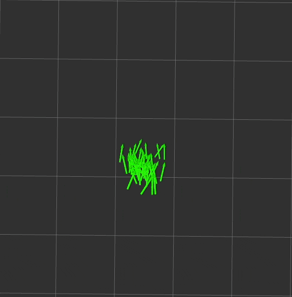
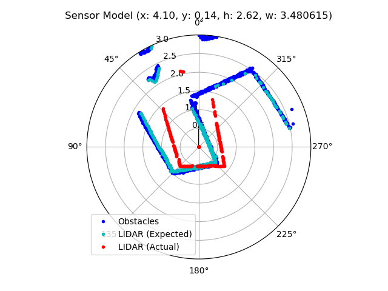

# Robot Localization Project
#### Ari Porad, Olin College, A Computational Introduction to Robotics (IS, Spring 2022), 4/25/2022

## Introduction


_A full run of the particle filter. The fact that the red LIDAR data lines up with the black map indicates that the filter is accurately identifying the robot's position._

This project implements a [particle filter][wikipedia], which enables the robot to use real-time data from its LIDAR and odometry sensors, along with a pre-made map of its environment, to estimate its current position. 

[This video][particle filter video] provides a good explanation of how a particle filter works, without any equations. In a nutshell, the steps of a particle filter are (each step is described in more detail below):
1. Generate a bunch of particles, each of which has a position, orientation, and weight. Each particle represents a guess of where the robot _might_ be.
2. Randomly re-sample the particles, according to their weights.
3. Update each particle to account for the motion of the robot, using the motion model.
	- This motion model simply takes the position estimate from the robot's odometry system and adds random noise to it.
4. Re-weight each particle according to the sensor model's estimate of _how likely it is that the robot would have gotten the sensor data it got if it were in the particle's position._
	- For this project, the sensor model exclusively uses the robot's LIDAR sensor.
	- It evaluates sensor data using ray tracing, as described in more detail below.
5. Go to Step 2.

Importantly, a particle filter requires a pre-existing map of the environment to function. These maps were provided in the assignment. All testing was done using pre-recorded bag files in simulation.

## Initialization

The initialization phase is by far the simplest. A human estimates an initial position for the robot in RViz (using the 2D Pose Estimate tool, which publishes to the `/initialpose` topic). This position becomes the sole initial particle. When the standard re-sampling phase runs for the first time, it repeatedly samples this particle to build up a full set of particles (currently, 200).

## Re-sampling



_Particles being re-sampled._

At the start of each update cycle, the filter re-samples its particles. Conducting a proper 2D random sample with a normal distribution for each particle proved conceptually difficult to reason about (I was inclined to sample x, y, and heading individually). However, it's quite simple in practice: combining two (or more) distributions is equivalent to randomly selecting between them, then taking a random sample from the distribution you picked. In practical terms, the filter makes a random choice between particles (weighted appropriately), then takes a random sample from a normal distribution centered on that particle's x/y/heading.

## Motion Model


_Particles following the motion of the robot, but each diverging in its own direction._

Each re-sampled particle is then updated to reflect the robot's motion (ie. if the robot was at the particle at the last update, where would you expect it to have driven to since then?). The motion model for this project is fairly primitive: it uses the position estimate from the robot's odometry system and adds some random error (currently, ±5%).

Importantly, each particle needs to be adjusted by the robot's motion _adjusted by the heading of the particle._ Performing this calculation (im)properly was the source of many bugs and much frustration.

## Sensor Model



_Debugging visualization of the actual and expected LIDAR data of a particle. This particle is a rather poor fit for the current sensor data._

Each motion-adjusted particle is re-weighted according to the likelihood that the robot would have gotten the sensor data it got if it was at that particle's location. My sensor model uses ray-tracing against the map to calculate which obstacle the LIDAR beam would have hit and what reading it would have returned, then compares that against the actual data. A heuristic formula is used to convert the differences between actual and expected LIDAR data to a single numerical weight for the particle.

The ray tracing algorithm is:
1. Convert the provided map into a set of discrete obstacles, each of which is a single point in Cartesian space. (This is done once at startup.)
2. Translate those obstacle points such that they are relative to the particle's position.
3. Convert the obstacle points to a polar coordinate space, then rotate them by the particle's heading. The obstacles are now in a coordinate space where the particle is at $(0\degree, 0)$ and pointing in the direction of $\theta = 0\degree$. (This is straight up in the diagram above.)
4. Convert the $\theta$-value of each obstacle point to degrees, and descretize/round them to whole-degree increments.
	- Radians are used everywhere else, but the LIDAR returns data as a 360-length list where the $i\text{th}$ element corresponds to the reading at $i \degree$, so this format is substantially more convenient.
5. For each degree from $0 \ldots 359$, find the obstacle with the lowest $r$-value (ie. closest to the origin). This is the obstacle that the LIDAR beam would have hit, so its distance from the origin is the expected LIDAR reading.
6. Compare the expected and actual LIDAR readings. Convert the differences to a single weight for the particle using the following experimentally-determined heuristic:

  $$w = \Sigma \left( 0.5 \times e^{-\frac{\left(d_{actual, i} - d_{expected, i} \right) ^2}{0.01}} \right)^3 \forall \left|d_{actual, i} - d_{expected, i} \right| > 0 $$

The robot's position is then estimated as the weighted average of the particles.

The sensor model was the subject of much implementation difficulty, especially around performance. See below for more details.

### A Note About Occupancy Fields

Traditionally, students in this course don't implement ray tracing. Instead, they use an occupancy field with projected LIDAR data. I attempted this, but the structure of the provided occupancy field made it difficult to fully visualize the data (because, unlike ray tracing, details of the map were not preserved and so couldn't be visualized; see below for a note on visualization). I'm confident I could have gotten the occupancy field to work given enough effort, but I wanted to implement ray tracing anyways, so wasn't highly motivated to spent time debugging the occupancy field. Instead, I took advantage of the fact that this is an independent study and ran with ray tracing.

## Implementation Details

### Code Structure

For this project, I tried to strike a balance between writing clean, well-abstracted code and not over-optimizing to the extent that code structure proved an impediment to productivity and iteration. While definitely not perfect, overall I'm pleased with the balance I was able to achieve.

In particular, there were several instances where logic that I would usually put in a self-contained function instead was wrapped in a class. This allowed configuration parameters to be stored as properties of the instance instead of being passed at the call site. For example:

```python
# Before
from helpers import random_sample

class Whatever:
	position_stddev = 3.0
	position_noise = 0.02
	position_noise_range = (-5, 5)

	def do_something(self):
		position = ...

		# Mixing of concerns! Bad!
		return random_sample(
			position,
			stddev=self.position_stddev,
			noise=self.position_noise,
			noise_range=self.position_noise_range
		)

# After
from helpers import RandomSampler

class Whatever:
	position_sampler = RandomSampler(
		stddev=3.0, noise=0.02, noise_range=(-5, 5)
	)

	def do_something(self):
		position = ...

		# We don't care about parameters, just about sampling!
		return self.position_sampler.sample(position)
```

The core of the filter is in the [`ParticleFilter`](scripts/pf.py) class, with the motion model in [`MotionModel`](scripts/motion_model.py), the sensor model in several classes in [`sensor_model.py`](scripts/sensor_model.py) (mostly `RayTracingParticleFilter`), and some helpers (including the `TFHelper` class provided with the assignment) in [`helper_functions.py`](scripts/helper_functions.py).


### Sensor Model Performance

_All performance measurements are on Ubuntu 20.04 running inside Parallels Desktop on my MacBook Pro with macOS 12.2.1 and an M1 Pro. All performance numbers are approximate._

Ray tracing, put simply, is quite slow. A naive implementation of the algorithm described above takes ~550ms for each update (with 200 particles), giving a refresh rate of 2Hz. At that speed, the filter simply can't keep up with the motion of the robot and quickly gets confused. (Before I went down this rabbit-hole, I verified this hypothesis by using the awesome powers of `rosbag` to slow down time substantially, which did in fact improve the performance of the filter.)

Some basic instrumentation suggested that almost all of the update time was spent in the ray tracing algorithm, so I focused my efforts there. 

My first approach was to try and use as much NumPy as possible. For the uninitiated, NumPy is a magical piece of software when it comes to performance: it's almost entirely implemented in C, with the Python code simply gluing chunks of C together. This means that (in general) if you use NumPy methods instead of Python loops, all data processing happens in very fast C, while the Python glue _is $O(1)$ with respect to the data._

Reworking the ray tracing algorithm to use as much NumPy as possible was moderately difficult. In particular, much of the algorithm has to be implemented and conceptualized somewhat differently to fit with the tools NumPy offers. Additionally, I wasn't able to completely eliminate Python loops: one loop remains, although it's $O(n)$ with respect to the number of LIDAR data points (ie. always $O(360)$) instead of the number of obstacle points, which is far better. Ultimately, using NumPy cut about 100ms off of the update time (yielding ~2.5Hz of update frequency), which is better but still nowhere near good enough.

After I got all I could from using NumPy, I turned my attention to the best and worst of performance optimization: parallelism.

Ray tracing is an embarrassingly parallel task: each particle can be considered completely individually with no changes to the algorithm. This made me optimistic that significant improvements could be achieved through parallelism.

I came across Python's extremely convenient [`concurrent.futures`][python-concurrency] library, which nearly-seamlessly allows for parallel mapping of an iterable. It supports two modes of parallelism: threads (which requires almost no code changes) or separate processes (which requires some minor code changes). I started by trying the multithreaded mode for simplicity's sake--although I was pessimistic, because Python's multithreading is notoriously [not really multithreading][python-gil]. Sure enough, while multithreading did help some (cutting off another 100ish ms, for 3Hz total), it wasn't nearly enough. Finally, I made the required code changes to support multiprocessing, and I was delighted with the results: updates now took only _60ms_, for ~17Hz of update frequency. This was plenty fast enough for the filter to keep up with the robot's motion, and brought my optimization journey to an end--although I strongly suspect there's some more low-hanging optimization fruit were I inclined to pick it (see below).

## Challenges & Learnings

While there were many things I learned during this project, I think the most significant is far-and-away about visualization: It is, quite simply, impossible to debug any form of robotic program without visualizing it. This is frustrating because, among other things, good visualizations are difficult and time-consuming to build--and it's often hard to even figure out how you'd visualize the topic at hand.

Even with visualizations, debugging the particle filter was very hard, for many reasons: it is a non-deterministic algorithm, so it's hard to be certain about how it behaves; it's a very high-dimensional problem (there are hundreds of particles per second, each of which needs a full 2D diagram to be visualized); the visualizations themselves can be broken, or asking/answering the wrong question; and even when none of those things are a problem, it's hard to translate your intuition about what _should_ happen into math and code.

## Future Improvements

As with any project, there are countless improvements I'd make given more time. To name a few:

- More sophisticated tuning of the particle filter, possibly with a more sophisticated heuristic for generating a particle weight from the actual/expected LIDAR data comparison. 
- I think performance could be improved even more with additional effort. In particular, the current multiprocessing implementation is very inefficient. Also, the motion model could be parallelized too (in some tests, doing so yielded modest performance gains, but not enough to justify the additional complexity).
- Improved visualizations throughout the system for improved debugging. 
- Compare the accuracy of the ray tracing algorithm with a traditional occupancy-field-based model.

## Acknowledgements

Thank you to Paul Ruvolo for advising me on this independent study, and for helping me with this project. I would not have succeeded without his invaluable guidance.


	

[wikipedia]: https://en.wikipedia.org/wiki/Particle_filter
[warmup project]: https://github.com/ariporad/comprobo-warmup-project
[particle filter video]: https://www.youtube.com/watch?v=aUkBa1zMKv4
[python-concurrency]: https://docs.python.org/3/library/concurrent.futures.html
[python-gil]: https://realpython.com/python-gil/
